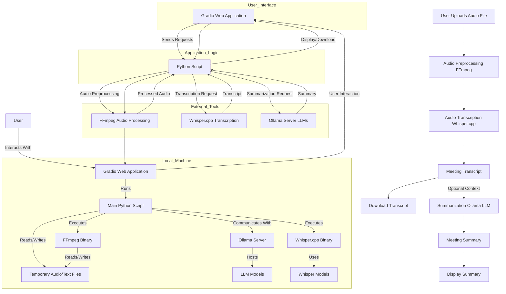

# Summariser

```mermaid
graph TD
    %% Main Flow
    A[User Uploads Audio File] --> B[Audio Preprocessing FFmpeg]
    B --> C[Audio Transcription Whisper.cpp]
    C --> D[Meeting Transcript]
    D -->|Optional Context| E[Summarization Ollama LLM]
    E --> F[Meeting Summary]
    D --> G[Download Transcript]
    F --> H[Display Summary]

    %% Subgraphs for System Components
    subgraph User_Interface
        UI[Gradio Web Application]
    end

    subgraph Application_Logic
        AL[Python Script]
    end

    subgraph External_Tools
        FF[FFmpeg Audio Processing]
        WC[Whisper.cpp Transcription]
        OS[Ollama Server LLMs]
    end

    subgraph Local_Machine
        UI_APP[Gradio Web Application]
        PYTHON_SCRIPT[Main Python Script]
        OLLAMA_SERVER[Ollama Server]
        WHISPER_BINARY[Whisper.cpp Binary]
        FFMPEG_BINARY[FFmpeg Binary]
        TEMP_FILES[Temporary Audio/Text Files]
        LLM_MODELS[LLM Models]
        WHISPER_MODELS[Whisper Models]
    end

    %% Interactions
    USER[User] -->|Interacts With| UI_APP
    UI_APP -->|User Interaction| UI
    UI -->|Sends Requests| AL
    AL -->|Audio Preprocessing| FF
    FF -->|Processed Audio| AL
    AL -->|Transcription Request| WC
    WC -->|Transcript| AL
    AL -->|Summarization Request| OS
    OS -->|Summary| AL
    AL -->|Display/Download| UI

    %% Local Machine Connections
    UI_APP -->|Runs| PYTHON_SCRIPT
    PYTHON_SCRIPT -->|Communicates With| OLLAMA_SERVER
    PYTHON_SCRIPT -->|Executes| WHISPER_BINARY
    PYTHON_SCRIPT -->|Executes| FFMPEG_BINARY
    PYTHON_SCRIPT -->|Reads/Writes| TEMP_FILES
    OLLAMA_SERVER -->|Hosts| LLM_MODELS
    WHISPER_BINARY -->|Uses| WHISPER_MODELS
    FFMPEG_BINARY -->|Reads/Writes| TEMP_FILES

    %% Invisible edges to force vertical subgraph stacking
    UI -->| | AL
    AL -->| | FF
    FF -->| | UI_APP
```